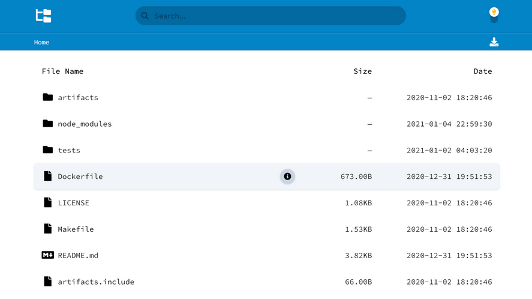

<!--
Важно: этот README был автоматически сгенерирован <https://github.com/YunoHost/apps/tree/master/tools/readme_generator>
Он НЕ ДОЛЖЕН редактироваться вручную.
-->

# Directory Lister для YunoHost

[](https://ci-apps.yunohost.org/ci/apps/directorylister/)  

[](https://install-app.yunohost.org/?app=directorylister)

*[Прочтите этот README на других языках.](./ALL_README.md)*

> *Этот пакет позволяет Вам установить Directory Lister быстро и просто на YunoHost-сервер.*  
> *Если у Вас нет YunoHost, пожалуйста, посмотрите [инструкцию](https://yunohost.org/install), чтобы узнать, как установить его.*

## Обзор

Directory Lister is the easiest way to expose the contents of any web-accessible folder for browsing and sharing. With a zero configuration, drag-and-drop installation you'll be up and running in less than a minute.

### Features

- Simple installation
- Light and dark themes
- Custom sort ordering
- File search
- File hashes
- Readme rendering
- Zip downloads
- Multi-lingual


**Поставляемая версия:** 4.2.2~ynh1

**Демо-версия:** <https://demo.directorylister.com/>

## Снимки экрана



## Документация и ресурсы

- Официальный веб-сайт приложения: <https://www.directorylister.com/>
- Официальная документация администратора: <https://docs.directorylister.com/>
- Репозиторий кода главной ветки приложения: <https://github.com/DirectoryLister/DirectoryLister>
- Магазин YunoHost: <https://apps.yunohost.org/app/directorylister>
- Сообщите об ошибке: <https://github.com/YunoHost-Apps/directorylister_ynh/issues>

## Информация для разработчиков

Пришлите Ваш запрос на слияние в [ветку `testing`](https://github.com/YunoHost-Apps/directorylister_ynh/tree/testing).

Чтобы попробовать ветку `testing`, пожалуйста, сделайте что-то вроде этого:

```bash
sudo yunohost app install https://github.com/YunoHost-Apps/directorylister_ynh/tree/testing --debug
или
sudo yunohost app upgrade directorylister -u https://github.com/YunoHost-Apps/directorylister_ynh/tree/testing --debug
```

**Больше информации о пакетировании приложений:** <https://yunohost.org/packaging_apps>
